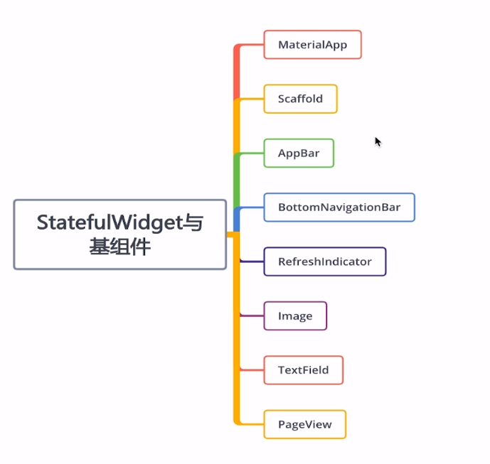

# StatefulWidget


- MaterialApp (基本プロジェクトの根に置く)
- Scaffold (appbar + BottomNavigationBar(下のメニューバー) + 横のバー)
- appbar (上のナビバー)
- BottomNavigationBar (下のナビバー)
- RefreshIndicator (画面更新用)
- image
- TextField (入力欄)
- PageView (swidde)

## RefreshIndicator
appbarのbodyに使用することが多い
中にListViewがないと使えない
```dart:
RefreshIndicator(
            child: ListView(
              children: [
                Text("home")
              ],
            ),
            onRefresh: _handleRedresh,
          ),
...
  Future<Null>_handleRedresh() async{ //timeoutの設定
    await Future.delayed(Duration(microseconds: 200));
    return null;
  }
```

## BottomNavigationBar
```dart:
        bottomNavigationBar: BottomNavigationBar(
          currentIndex: this._currentIndex,
            onTap: (index){ //itemのクリックイベント
               setState(() {
                 this._currentIndex = index;
               });
            },
            items: [
          BottomNavigationBarItem(
            icon: Icon(Icons.home, color: Colors.green,),
            activeIcon: Icon(Icons.home, color: Colors.blue,),
            title: Text("home")
          ),
          BottomNavigationBarItem(
              icon: Icon(Icons.list, color: Colors.green,),
              activeIcon: Icon(Icons.list, color: Colors.blue,),
            title: Text("list")
          )
        ]),
```


## TextField
使用例
```dart:
                   TextField( //入力欄
                     // 入力欄のスタイル
                     decoration: InputDecoration(
                       contentPadding: EdgeInsets.fromLTRB(5, 0, 0, 0),
                       hintText: "何か入力して",
                       hintStyle: TextStyle(fontSize: 15)
                     ),
                    //  value 変化時に実行します。
                    onChanged: (val) {
                        print(val);
                    }
                   ),
```

