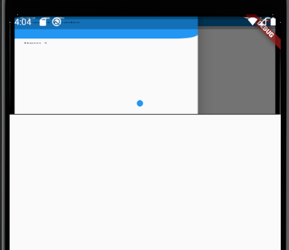

# スライダープラグイン


インストールurl
```
https://pub.dev/packages/flutter_swiper
```

使用

```dart:
import 'package:flutter/material.dart';
import 'package:flutter_swiper/flutter_swiper.dart';

class SwiperPage extends StatefulWidget {
  @override
  _SwiperPageState createState() => _SwiperPageState();
}

class _SwiperPageState extends State<SwiperPage> {
  List _imageUrls = [
   'https://raw.githubusercontent.com/huanshenyi/flutte_len/master/lens/%E3%82%BF%E3%82%B0%E3%83%90%E3%83%BC%E3%80%81%E5%B7%A6%E3%81%AE%E3%83%89%E3%83%A9%E3%82%B0%E3%83%90%E3%83%BC%E3%81%AA%E3%81%A9/drawer.PNG',
   'https://raw.githubusercontent.com/huanshenyi/flutte_len/master/lens/flutter%E3%81%AE%E3%83%AB%E3%83%BC%E3%83%88/router.PNG'
  ];
  @override
  Widget build(BuildContext context) {
    return Scaffold(
      body: Center(
        child: Column(
          children: [
             Container( //Swiper バナーの大きさを決める用のContainer
                height: 160, //Swiperの高さ
                child: Swiper(
                    itemCount: _imageUrls.length, //画像数
                    autoplay: true, //自動スクロール
                    itemBuilder: (BuildContext context, int index){
                      return Image.network(
                        _imageUrls[index],
                        fit: BoxFit.fill, //表示する形式
                      );
                    },
                  pagination: SwiperPagination(), //ページネーション
                ),
             )
          ],
        ),
      ),
    );
  }
}

```