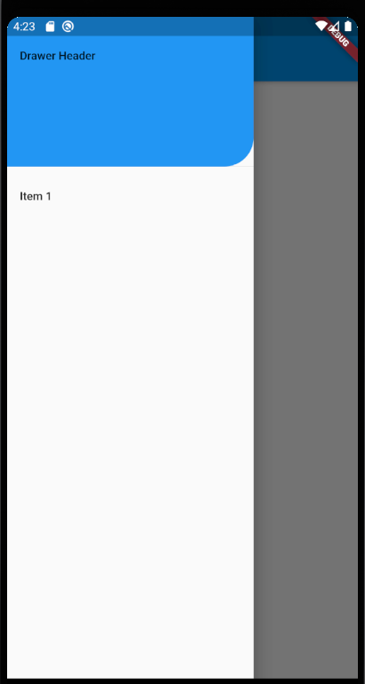

# 左の引き出しバー(drawer)

```dart
class DrawerDemo extends StatelessWidget {
  @override
  Widget build(BuildContext context) {
    return Scaffold(
      appBar: AppBar(title: Text("drawer")),
      body: Center(child: Text("My Page!")),
      drawer: Drawer(
        child: ListView(
          padding: EdgeInsets.zero,
          children: [
            DrawerHeader(child: Text("Drawer Header"),
              decoration: BoxDecoration(
                color: Colors.blue,
                borderRadius: BorderRadius.only(
                  bottomRight: Radius.circular(36)
                )
              ),
            ),
            ListTile(
              title: Text("Item 1"),
              onTap: (){
                Navigator.pop(context);
              },
            )
          ],
        ),
      ),
    );
  }
}
```
# タブーナビゲーション
 タブーでページ移転する
 
 
 
 ```dart
import 'package:flutter/material.dart';
import 'package:flutter_tests/pages/home_page.dart';
import 'package:flutter_tests/pages/search_page.dart';

class TabNavigator extends StatefulWidget {
  @override
  _TabNavigatorState createState() => _TabNavigatorState();
}

class _TabNavigatorState extends State<TabNavigator> {
  final _defaultColor = Colors.grey;
  final _activeColor = Colors.blue;
  int _currentIndex = 0;
  final PageController _controller = PageController(
    initialPage: 0,
  );

  @override
  Widget build(BuildContext context) {
    return Scaffold(
      appBar: AppBar(
        title: Text('TabNav'),
      ),
      body: PageView(
        controller: _controller,
        children: <Widget>[
          HomePage(),
          SearchPage(),
        ],
      ),
      bottomNavigationBar: BottomNavigationBar(
          currentIndex: _currentIndex,
          onTap: (index) {
            _controller.jumpToPage(index);
            setState(() {
              _currentIndex = index;
            });
          },
          type: BottomNavigationBarType.fixed,
          items: [
            BottomNavigationBarItem(
                icon: Icon(Icons.home, color: _defaultColor),
                activeIcon: Icon(Icons.home, color: _activeColor),
                title: Text(
                  '首页',
                  style: TextStyle(
                      color: _currentIndex != 0 ? _defaultColor : _activeColor),
                )),
            BottomNavigationBarItem(
                icon: Icon(Icons.search, color: _defaultColor),
                activeIcon: Icon(Icons.search, color: _activeColor),
                title: Text(
                  '搜索',
                  style: TextStyle(
                      color: _currentIndex != 1 ? _defaultColor : _activeColor),
                )),
          ]),
    );
  }
}
```