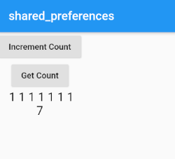

# shared_preferences

*ローカルにデータを保存する*

プラグインインストール
```
https://pub.dev/packages/shared_preferences
```

## データ保存
```dart:
final prefs = await SharedPreferences.getInstance();

// set value
prefs.setInt('counter', counter);
```

その他の保存用API


## データの読み取り
```dart:
final prefs = await SharedPreferences.getInstance();

// Try reading data from the counter key. If it does not exist, return 0.
final counter = prefs.getInt('counter') ?? 0;}
```
その他の読み取りAPI


## 削除
```dart:
final prefs = await SharedPreferences.getInstance();
prefs.remove('counter');
```

# 使用例


```dart:
import 'package:flutter/material.dart';
import 'package:shared_preferences/shared_preferences.dart';

class Usershared_P extends StatefulWidget {
  @override
  _Usershared_PState createState() => _Usershared_PState();
}

class _Usershared_PState extends State<Usershared_P> {
  // 足した結果
  String countString = '';
  String localCount = '';

  @override
  Widget build(BuildContext context) {
    return MaterialApp(
      home: Scaffold(
        appBar: AppBar(
          title: Text("shared_preferences"),
        ),
        body: Column(
          children: [
            RaisedButton(
              onPressed: _incrementCounter,
              child: Text('Increment Count'),
            ),
            RaisedButton(
              onPressed: _getCounter,
              child: Text('Get Count'),
            ),
            Text(
              countString,
              style: TextStyle(fontSize: 20),
            ),
            Text(
              localCount,
              style: TextStyle(fontSize: 20),
            )
          ],
        ),
      ),
    );
  }
  _incrementCounter() async {
    SharedPreferences prefs = await SharedPreferences.getInstance();
    setState(() {
      countString = countString + " 1";
    });
    int counter = (prefs.getInt('counter') ?? 0) + 1;
    await prefs.setInt('counter', counter);
  }

  _getCounter() async {
    SharedPreferences prefs = await SharedPreferences.getInstance();
    setState(() {
      localCount = prefs.getInt('counter').toString();
    });

  }
}

```